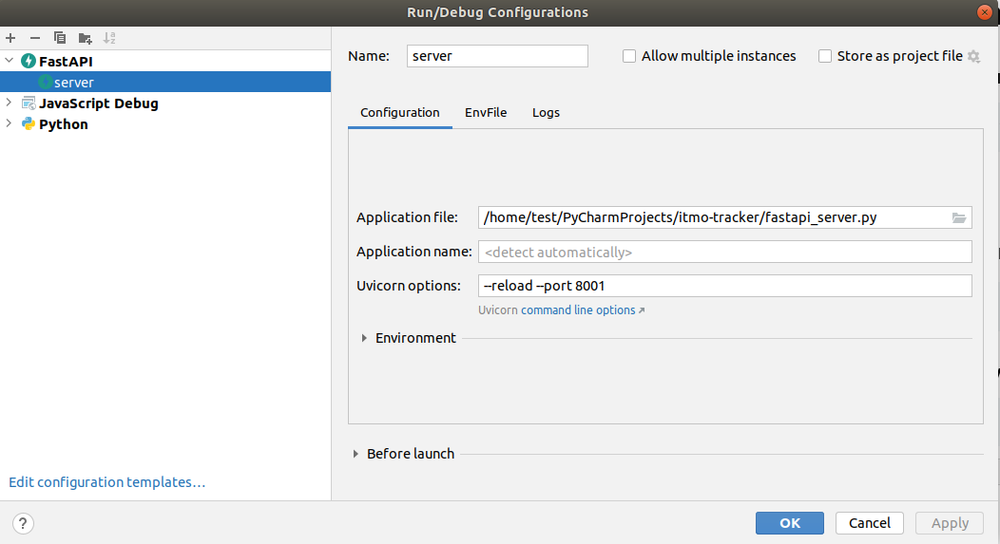

# Object Tracking Home assignment

### Установка зависимостей
```
pip install -r requirements.txt
```

### Запуск сервера
Или настройте запуск файла fastapi_server.py как приведено на скриншоте ниже 


или командой в терминале
```
python3 -m uvicorn fastapi_server:app --reload --port 8001 
```

Запуск веб сервера http://localhost:8000/
```
python3 -m http.server
```

### Постановка задачи

Реализуйте методы tracker_soft и tracker_strong в скрипте fastapi_server.py,
придумайте, обоснуйте и реализуйте метод для оценки качества разработанных трекеров.
Сравните результаты tracker_soft и tracker_strong для 5, 10, 20 объектов и различных 
значений random_range и bb_skip_percent
(информацию о генерации данных читай в пункте "Тестирование"). Напишите отчёт. 
В отчете необходимо в свободном стиле привести описание методов tracker_soft, 
tracker_strong, метода оценки качества трекеров, привести сравнительную таблицу 
реализованных трекеров, сделать вывод.  
Бонусом можете выписать найденные баги в текущем проекте.

### Тестирование
Для тестирования можно воспользоваться скриптом create_track.py. Скрипт генерирует
информацию об объектах и их треках. Скопируйте вывод в новый скрипт track_n.py и
скорректируйте импорт в fastapi_server.py
```
from track_n import track_data, country_balls_amount
```
Что стоит менять в скрипте create_track.py:  
**tracks_amount**: количество объектов  
**random_range**: на сколько пикселей рамка объектов может ложно смещаться (эмуляция не идеальной детекции)  
**bb_skip_percent**: с какой вероятностью объект на фрейме может быть не найдет детектором  


### Решение
Данное решение представляет собой систему трекинга объектов (в данном случае - виртуальных "стран-шаров") с двумя различными алгоритмами отслеживания и подсчетом метрик качества работы. В системе реализованы два основных трекера: простой (tracker_soft) и продвинутый (tracker_strong).

Простой трекер (tracker_soft) использует подход на основе сопоставления ограничивающих рамок (bounding boxes) через матрицу IoU (Intersection over Union) и применяет венгерский алгоритм для оптимального назначения идентификаторов. Эта реализация специально оптимизирована для работы на маломощных устройствах, таких как Raspberry Pi.

Продвинутый трекер реализует более сложный двухэтапный подход. На первом этапе для обнаружения объектов применяется метод компьютерного зрения — сопоставление по шаблону (cv2.matchTemplate), оптимально для среды с однородным фоном. Качество совпадения шаблона преобразуется в показатель уверенности (confidence score), который затем используется на втором этапе алгоритмом ByteTrack из библиотеки supervision. Ключевой частью системы является подсчет метрик качества, основной из которых выступает ID switches — количество переключений идентификаторов. Эта метрика отслеживает случаи, когда один и тот же объект получает разные track_id в последовательных кадрах. Система подсчета была доработана для обеспечения корректности и согласованности между обоими трекерами, а для tracker_strong была добавлена логика инициализации, гарантирующая присвоение ID с первого кадра и делающая подсчет метрик надежным в любых условиях работы.
